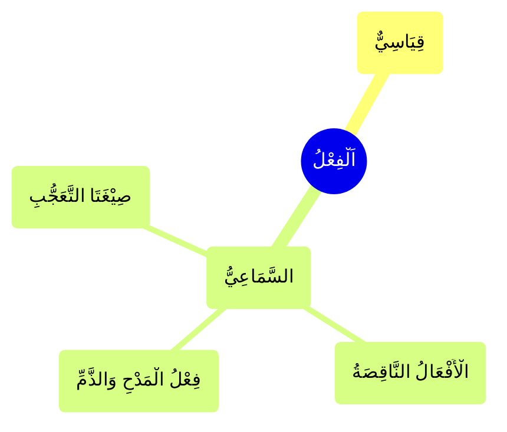

---
label: "اَلْفِعْلُ"
sidebar_label: "اَلْفِعْلُ"
sidebar_position: 1
---

# الْفِعْلِ الْعَامِلِ

وَ هُوَ نَوْعَانِ

## الْقِيَاسِيْ

وهو فعل عادي، ومن الممكن إنشاء أفعال جديدة مثله، وهي تتبع نمطًا ثابتًا.

## السَّمَاعِيُّ

وهو ما يُسمع من القول العرب. لا ممكن أن نئت بفعل آخر بمثله

