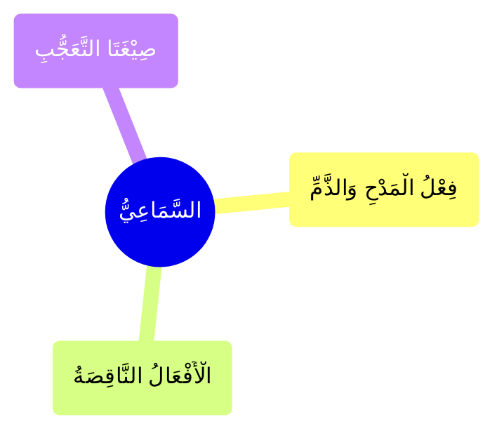

---
label: "النَّوْعُ الثَّانِيْ السَّمَاعِيُّ"
sidebar_label: "السَّمَاعِيُّ"
sidebar_position: 2
---

# السَّمَاعِيُّ

وَهُوَ ثَلَاثَةُ أَقْسَامٍ

### الْفِعْلُ النَّاقِصُ

### فِعْلُ الْمَدْحِ وَالذَّمِّ

### صِيْغَتَا التَّعَجُّبِ

#

