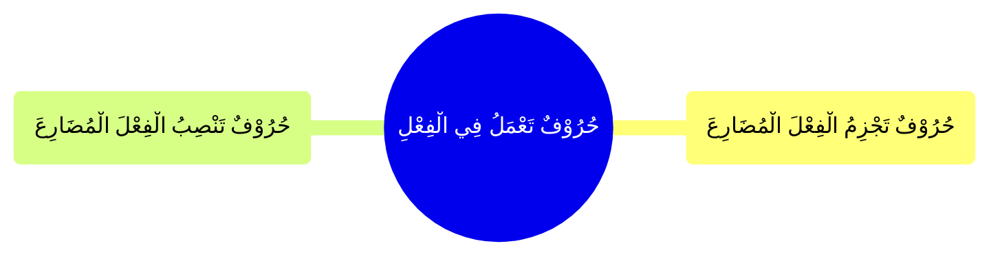

---
label: "اَلنَّوْعُ الثَّانِيْ حُرُوْفٌ تَعْمَلُ فِي الْفِعْلِ"
sidebar_label: "حُرُوْفٌ تَعْمَلُ فِي الْفِعْلِ"
sidebar_position: 2
---

# حُرُوْفٌ تَعْمَلُ فِي الْفِعْلِ

وَهُوَ قِسْمَانِ

## حُرُوْفٌ تَنْصِبُ الْفِعْلَ الْمُضَارِعَ

## حُرُوْفٌ تَجْزِمُ الْفِعْلَ الْمُضَارِعَ

