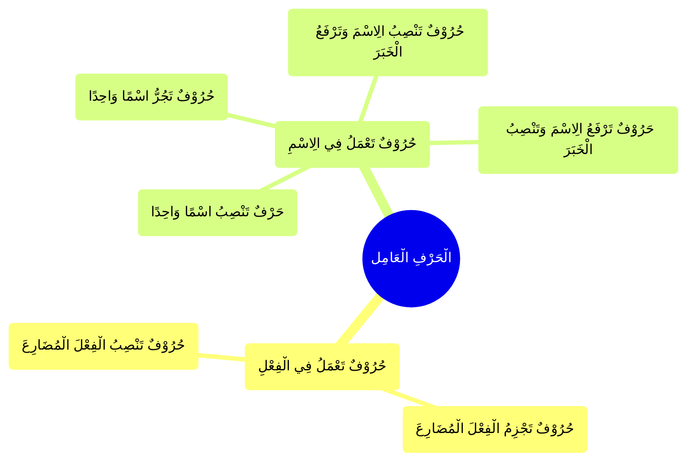

---
label: "الْحَرْفِ الْعَامِل"
sidebar_label: "الْحَرْفِ الْعَامِل"
sidebar_position: 2
---

# الْفِعْلِ الْعَامِلِ

وَ هُوَ نَوْعَانِ

## حُرُوْفٌ تَعْمَلُ فِي الِاسْمِ،

## حُرُوْفٌ تَعْمَلُ فِي الْفِعْلِ

#

