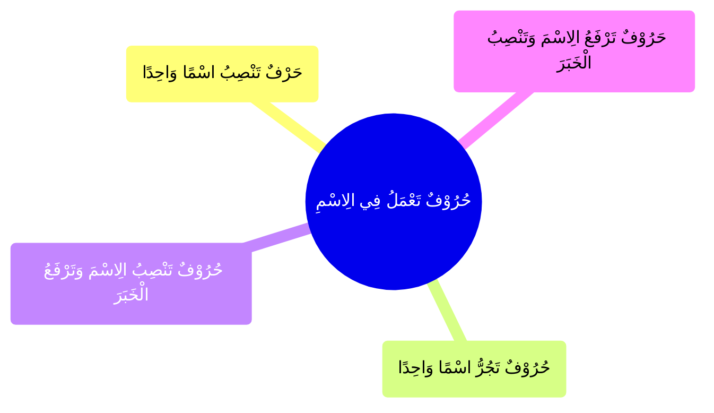

---
label: "النَّوْعُ الْأَوَّلُ حُرُوْفٌ تَعْمَلُ فِي الِاسْمِ"
sidebar_label: "حُرُوْفٌ تَعْمَلُ فِي الِاسْمِ"
sidebar_position: 1
---

# حُرُوْفٌ تَعْمَلُ فِي الِاسْمِ

وَهِيَ أَرْبَعَةُ أَقْسَامٍ

1. تَجُرُّ اسْمًا وَاحِدًا

2. تَنْصِبُ اسْمًا وَاحِدًا

3. تَنْصِبُ الِاسْمَ وَتَرْفَعُ الْخَبَرَ

4. تَرْفَعُ الِاسْمَ وَتَنْصِبُ الْخَبَرَ

---

