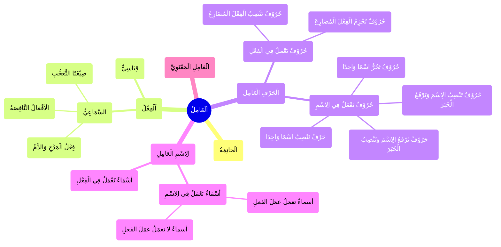

# اَلْعَامِلُ

وَ فِيْهِ أَرْبَعَةُ أَبْوَابٍ وَخَاتِمَةٌ

```mermaid
mindmap
  root((اَلْعَامِلُ))
    id1(الْخَاتِمَةُ)
    id2(اَلْفِعْلُ)
      id3(قِيَاسِيٌّ)
      id4(السَّمَاعِيُّ)
        id5(فِعْلُ الْمَدْحِ وَالذَّمِّ)
        id6(الْأَفْعَالُ النَّاقِصَةُ)
        id7(صِيْغَتَا التَّعَجُّبِ)
    id8(الْحَرْفِ الْعَامِل)
      id9(حُرُوْفٌ تَعْمَلُ فِي الْفِعْلِ)
        id10(حُرُوْفٌ تَجْزِمُ الْفِعْلَ الْمُضَارِعَ)
        id11(حُرُوْفٌ تَنْصِبُ الْفِعْلَ الْمُضَارِعَ)
      id12(حُرُوْفٌ تَعْمَلُ فِي الِاسْمِ)
        id13(حَرْفٌ تَنْصِبُ اسْمًا وَاحِدًا)
        id14(حُرُوْفٌ تَجُرُّ اسْمًا وَاحِدًا)
        id15(حُرُوْفٌ تَنْصِبُ الِاسْمَ وَتَرْفَعُ الْخَبَرَ)
        id16(حَرُوْفٌ تَرْفَعُ الِاسْمَ وَتَنْصِبُ الْخَبَرَ)
    id17(الِاسْمِ الْعَامِلِ)
      id18(أَسْمَاءٌ تَعْمَلُ فِي الْفِعْلِ)
      id19(أَسْمَاءٌ تَعْمَلُ فِي الِاسْمِ)
        id20(أسماءٌ تعمَلُ عمَلَ الفعلِ)
        id21(أسماءٌ لا تعمَلُ عمَلَ الفعلِ)
    id22(الْعَامِلِ الْمَعْنَوِيِّ)
```
