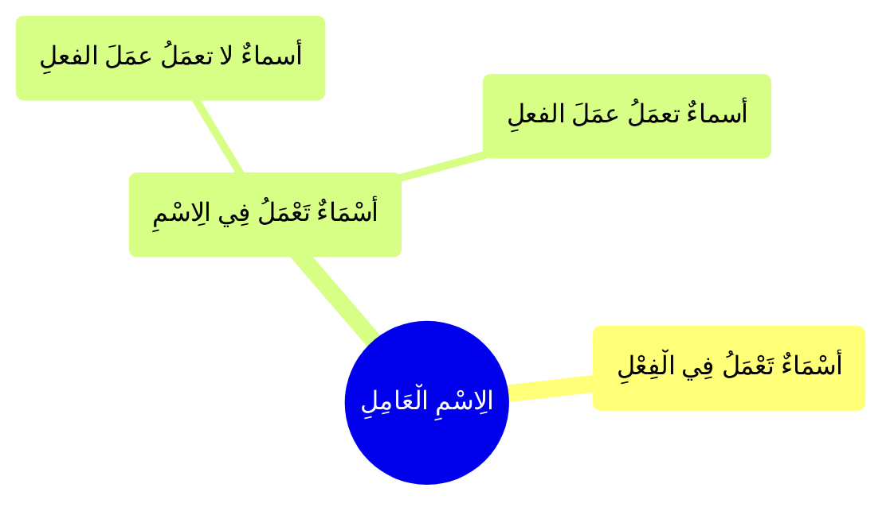

---
label: "الِاسْمِ الْعَامِلِ"
sidebar_label: "الِاسْمِ الْعَامِلِ"
sidebar_position: 3
---

# الِاسْمِ الْعَامِلِ

وَ هُوَ نَوْعَانِ

### أَسْمَاءٌ تَعْمَلُ فِي الِاسْمِ

### أَسْمَاءٌ تَعْمَلُ فِي الْفِعْلِ

