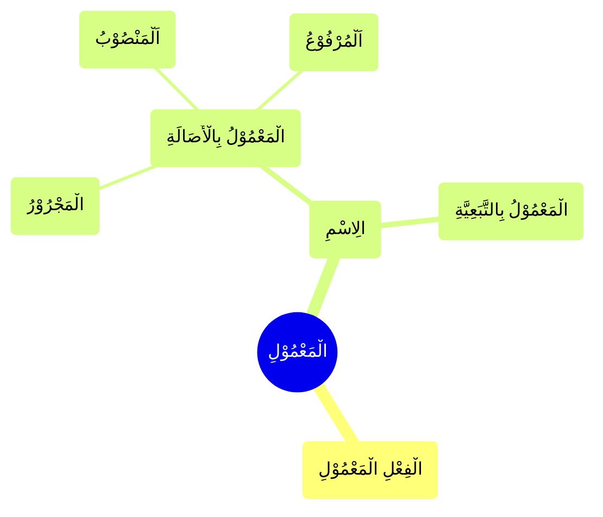

# الْمَعْمُوْلِ

وَ فِيْهِ بَابَانِ

```mermaid
mindmap
  root((الْمَعْمُوْلِ))
    id1(الْفِعْلِ الْمَعْمُوْلِ)
    id2(الِاسْمِ)
      id3(الْمَعْمُوْلُ بِالْأَصَالَةِ)
        id4(الْمَجْرُوْرُ)
        id5(اَلْمَنْصُوْبُ)
        id6(اَلْمُرْفُوْعُ)
      id7(الْمَعْمُوْلُ بِالتَّبَعِيَّةِ)
```
