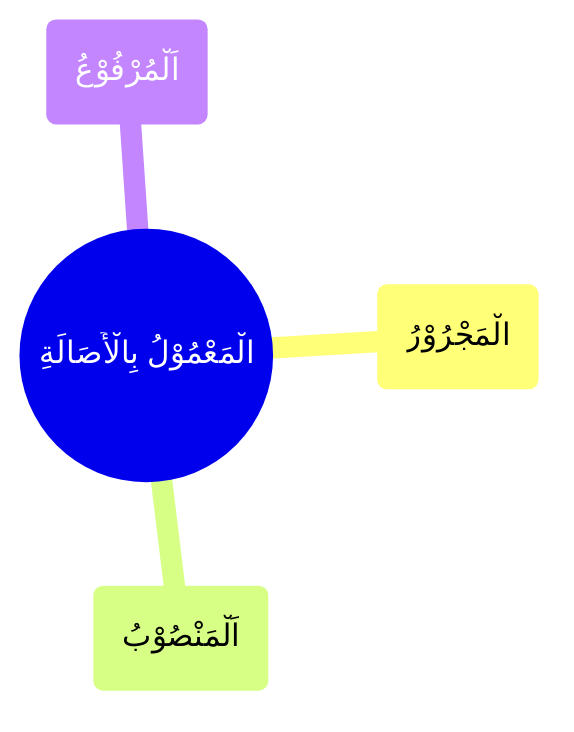

---
label: "اَلنَّوْعُ الْأَوَّلُ الْمَعْمُوْلُ بِالْأَصَالَةِ"
sidebar_label: "الْمَعْمُوْلُ بِالْأَصَالَةِ"
sidebar_position: 1
---

# الْمَعْمُوْلُ بِالْأَصَالَةِ

وَهُوَثَلاثَةُ أَقْسَامٍ

```mermaid
mindmap
  root((الْمَعْمُوْلُ بِالْأَصَالَةِ))
    id1(الْمَجْرُوْرُ)
    id2(اَلْمَنْصُوْبُ)
    id3(اَلْمُرْفُوْعُ)
```
