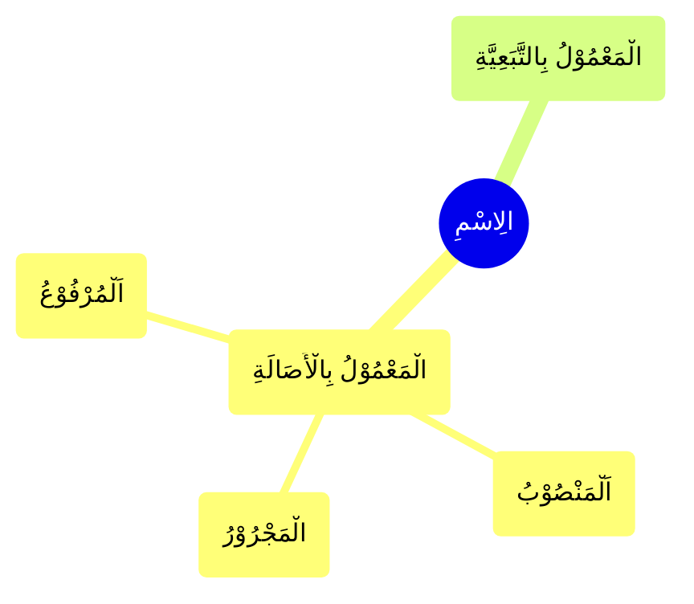

---
label: "الِاسْمِ"
sidebar_label: "الِاسْمِ"
sidebar_position: 1
---

# الِاسْمِ

وَ فِيْهِ نَوْعَانِ

### الْمَعْمُوْلُ بِالْأَصَالَةِ

### الْمَعْمُوْلُ بِالْتَبَعِيّةِ

```mermaid
mindmap
  root((الِاسْمِ))
    id1(الْمَعْمُوْلُ بِالْأَصَالَةِ)
      id2(الْمَجْرُوْرُ)
      id3(اَلْمَنْصُوْبُ)
      id4(اَلْمُرْفُوْعُ)
    id5(الْمَعْمُوْلُ بِالتَّبَعِيَّةِ)
```
