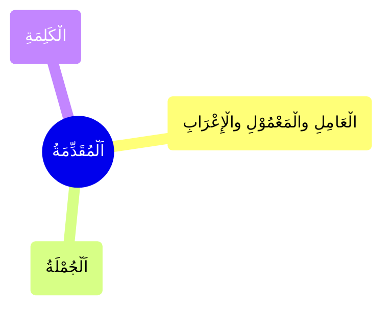

# اَلْمُقَدِّمَةُ

---

## اَلْمُقَدِّمَةُ وَفِيْهَا ثَلَاثَةُ أَبْوَابٍ

```mermaid
mindmap
  root((اَلْمُقَدِّمَةُ))
    id1(الْعَامِلِ والْمَعْمُوْلِ والْإِعْرَابِ)
    id2(اَلْجُمْلَةُ)
    id3(الْكَلِمَةِ)
```
