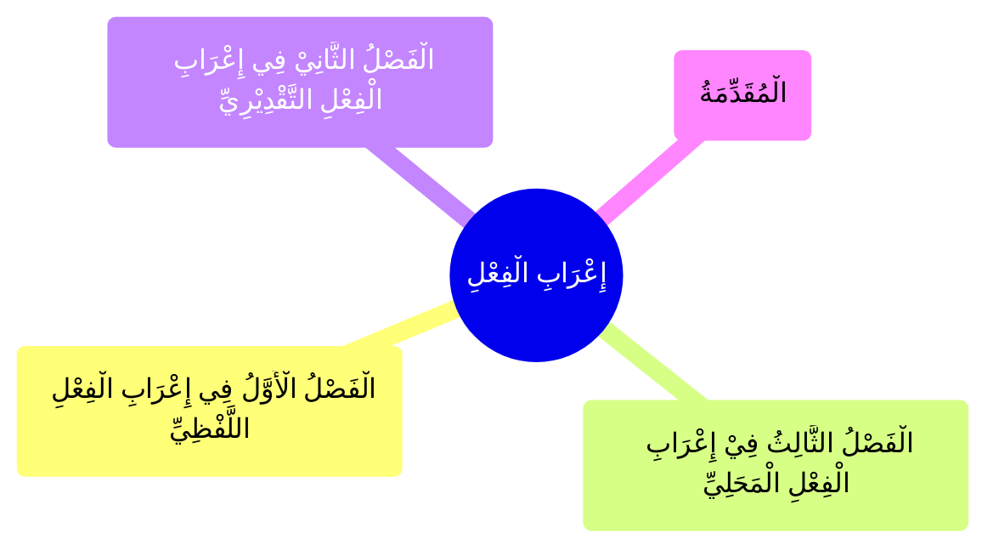

# إِعْرَابِ الْفِعْلِ

وَفِيْهِ مُقَدِّمَةٌ وَثَلَاثَةُ فُصُوْلٍ

```mermaid
mindmap
  root((إِعْرَابِ الْفِعْلِ))
    id1(الْفَصْلُ الْأَوَّلُ فِي إِعْرَابِ الْفِعْلِ اللَّفْظِيِّ)
    id2(الْفَصْلُ الثَّالِثُ فِيْ إِعْرَابِ الْفِعْلِ الْمَحَلِيِّ)
    id3(الْفَصْلُ الثَّانِيْ فِي إِعْرَابِ الْفِعْلِ التَّقْدِيْرِيِّ)
    id4(الْمُقَدِّمَةُ)
```
