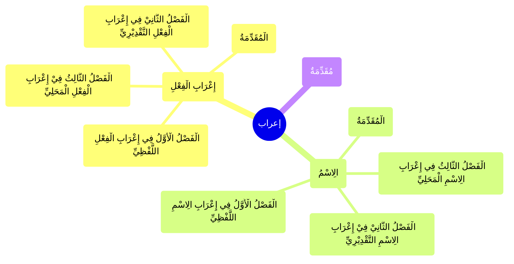

# الْإِعْرَابِ

وَفِيْهِ مُقَدِّمَةٌ وَبَابَانِ

```mermaid
mindmap
  root((إعراب))
    id1(إِعْرَابِ الْفِعْلِ)
      id2(الْفَصْلُ الْأَوَّلُ فِي إِعْرَابِ الْفِعْلِ اللَّفْظِيِّ)
      id3(الْفَصْلُ الثَّالِثُ فِيْ إِعْرَابِ الْفِعْلِ الْمَحَلِيِّ)
      id4(الْفَصْلُ الثَّانِيْ فِي إِعْرَابِ الْفِعْلِ التَّقْدِيْرِيِّ)
      id5(الْمُقَدِّمَةُ)
    id6(الِاسْمُ)
      id7(الْفَصْلُ الْأَوَّلُ فِي إِعْرَابِ الِاسْمِ اللَّفْظِيِّ)
      id8(الْفَصْلُ الثَّالِثُ فِي إِعْرَابِ الِاسْمِ الْمَحَلِيِّ)
      id9(الْفَصْلُ الثَّانِيْ فِيْ إِعْرَابِ الِاسْمِ التَّقْدِيْرِيِّ)
      id10(الْمُقَدِّمَةُ)
    id11(مُقَدِّمَةٌ)
```
