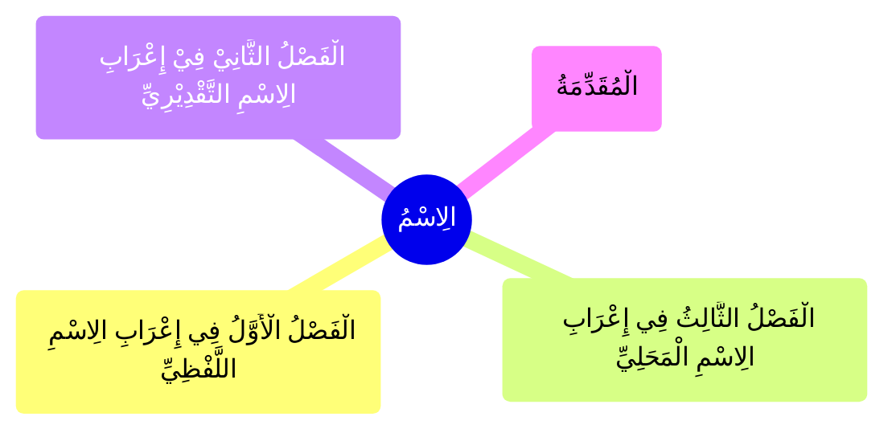

# إِعْرَابِ الِاسْمِ

وَفِيْهِ مُقَدِّمَةٌ وَثَلَاثَةُ فُصُوْلٍ

```mermaid
mindmap
  root((الِاسْمُ))
    id1(الْفَصْلُ الْأَوَّلُ فِي إِعْرَابِ الِاسْمِ اللَّفْظِيِّ)
    id2(الْفَصْلُ الثَّالِثُ فِي إِعْرَابِ الِاسْمِ الْمَحَلِيِّ)
    id3(الْفَصْلُ الثَّانِيْ فِيْ إِعْرَابِ الِاسْمِ التَّقْدِيْرِيِّ)
    id4(الْمُقَدِّمَةُ)
```
